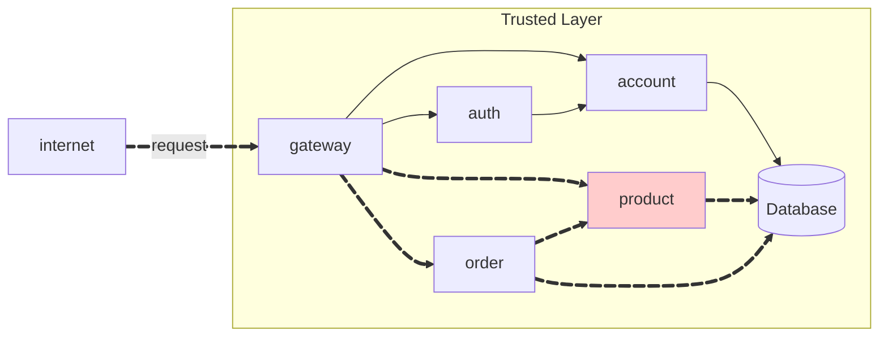
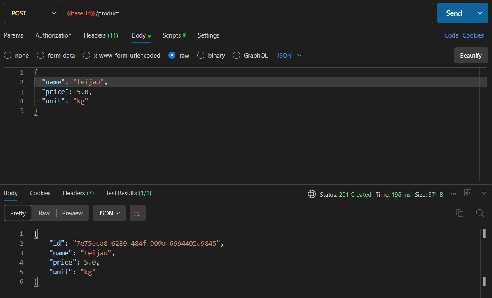
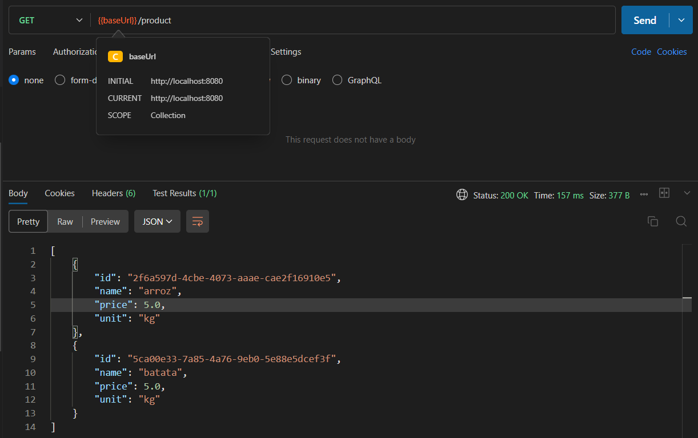
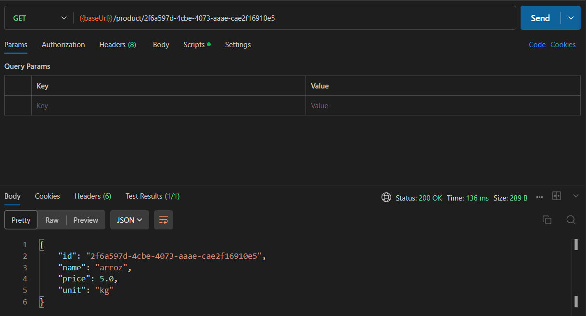

Create a RESTful API for a store. The API should have two main resources: `product` and `order`.



!!! warning "Attention"

    **To consume the API, the user must be authenticated.**

## Repositórios
- [Product](https://github.com/RicardolCarvalho/product)

```bash
product/
├── ProductController.java
├── ProductIn.java
├── ProductOut.java
```

- [Product-service](https://github.com/RicardolCarvalho/product-service)

```bash
product-service/
├── Product.java
├── ProductApplication.java
├── ProductModel.java
├── ProductParser.java
├── ProductRepository.java
├── ProductResource.java
├── ProductService.java
```


## Product API

The API should have the following endpoints:

!!! info "POST /product"

    Create a new product.

    === "Request"

        ``` { .json .copy .select linenums='1' }
        {
            "name": "Tomato",
            "price": 10.12,
            "unit": "kg"
        }
        ```

    === "Response"

        ``` { .json .copy .select linenums='1' }
        {
            "id": "0195abfb-7074-73a9-9d26-b4b9fbaab0a8",
            "name": "Tomato",
            "price": 10.12,
            "unit": "kg"
        }
        ```
        ```bash
        Response code: 201 (created)
        ```
    === "Postman"
        { width=100% }

!!! info "GET /product"

    Get all products.

    === "Response"

        ``` { .json .copy .select linenums='1' }
        [
            {
                "id": "0195abfb-7074-73a9-9d26-b4b9fbaab0a8",
                "name": "Tomato",
                "price": 10.12,
                "unit": "kg"
            },
            {
                "id": "0195abfe-e416-7052-be3b-27cdaf12a984",
                "name": "Cheese",
                "price": 0.62,
                "unit": "slice"
            }
        ]
        ```
        ```bash
        Response code: 200 (ok)
        ```
    === "Postman"
        { width=100% }

!!! info "GET /product/{id}"

    Get a product by its ID.

    === "Response"

        ``` { .json .copy .select linenums='1' }
        {
            "id": "0195abfb-7074-73a9-9d26-b4b9fbaab0a8",
            "name": "Tomato",
            "price": 10.12,
            "unit": "kg"
        }
        ```
        ```bash
        Response code: 200 (ok)
        ```
    === "Postman"
        { width=100% }

!!! info "DELETE /product/{id}"

    Delete a product by its ID.

    ```bash
    Response code: 204 (no content)
    ```

> This MkDocs was created by [Ricardo Luz Carvalho](https://github.com/RicardolCarvalho)