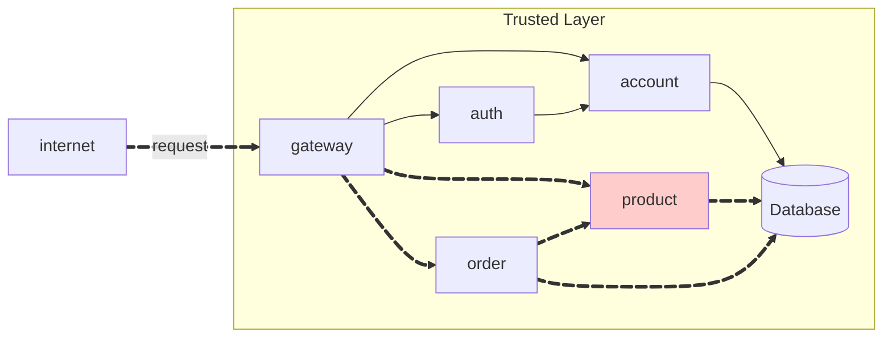

## Repositórios

### 1. Product Repository
**Link:** [https://github.com/RicardolCarvalho/product](https://github.com/RicardolCarvalho/product)

**Estrutura do projeto:**
```bash
product/
├── src/main/java/store/product/
│   ├── ProductController.java
│   ├── ProductIn.java
│   └── ProductOut.java
├── pom.xml
└── .gitignore
```

### 2. Product Service Repository
**Link:** [https://github.com/RicardolCarvalho/product-service](https://github.com/RicardolCarvalho/product-service)

**Descrição:** Repositório contendo a implementação completa do microserviço de produtos com Spring Boot.

**Estrutura do projeto:**
```bash
product-service/
├── src/main/
│   ├── Product.java
│   ├── ProductApplication.java
│   ├── ProductModel.java
│   ├── ProductParser.java
│   ├── ProductRepository.java
│   ├── ProductResource.java
│   └── ProductService.java
├── DockerFile
├── pom.xml
└── .gitignore
```

## Código Fonte das Atividades

### Principais Componentes Implementados

#### 1. ProductController.java
Controlador REST responsável por expor os endpoints da API de produtos:

```java
@RestController
@RequestMapping("/product")
public class ProductController {
    
    @Autowired
    private ProductService productService;
    
    @PostMapping
    public ResponseEntity<ProductOut> createProduct(@RequestBody ProductIn productIn) {
    }
    
    @GetMapping
    public ResponseEntity<List<ProductOut>> getAllProducts() {
    }
    
    @GetMapping("/{id}")
    public ResponseEntity<ProductOut> getProductById(@PathVariable String id) {
    }
    
    @DeleteMapping("/{id}")
    public ResponseEntity<Void> deleteProduct(@PathVariable String id) {
    }
}
```

#### 2. Product.java (Entidade)
Entidade JPA representando um produto no banco de dados:

```java
@Entity
@Table(name = "products")
public class Product {
    
    @Id
    @GeneratedValue(strategy = GenerationType.UUID)
    private String id;
    
    @Column(nullable = false)
    private String name;
    
    @Column(nullable = false)
    private Double price;
    
    @Column(nullable = false)
    private String unit;
}
```

#### 3. ProductService.java
Camada de serviço contendo a lógica de negócio:

```java
@Service
public class ProductService {
    
    @Autowired
    private ProductRepository productRepository;
    
    public ProductOut createProduct(ProductIn productIn) {
        Product product = ProductParser.toEntity(productIn);
        Product savedProduct = productRepository.save(product);
        return ProductParser.toOut(savedProduct);
    }
    
    public List<ProductOut> getAllProducts() {
        List<Product> products = productRepository.findAll();
        return products.stream()
                .map(ProductParser::toOut)
                .collect(Collectors.toList());
    }

}
```

## Product API

The API should have the following endpoints:

!!! info "POST /product"

    Create a new product.

    === "Request"

        ``` { .json .copy .select linenums='1' }
        {
            "name": "Tomato",
            "price": 10.12,
            "unit": "kg"
        }
        ```

    === "Response"

        ``` { .json .copy .select linenums='1' }
        {
            "id": "0195abfb-7074-73a9-9d26-b4b9fbaab0a8",
            "name": "Tomato",
            "price": 10.12,
            "unit": "kg"
        }
        ```
        ```bash
        Response code: 201 (created)
        ```
    === "Postman"
        { width=100% }

!!! info "GET /product"

    Get all products.

    === "Response"

        ``` { .json .copy .select linenums='1' }
        [
            {
                "id": "0195abfb-7074-73a9-9d26-b4b9fbaab0a8",
                "name": "Tomato",
                "price": 10.12,
                "unit": "kg"
            },
            {
                "id": "0195abfe-e416-7052-be3b-27cdaf12a984",
                "name": "Cheese",
                "price": 0.62,
                "unit": "slice"
            }
        ]
        ```
        ```bash
        Response code: 200 (ok)
        ```
    === "Postman"
        { width=100% }

!!! info "GET /product/{id}"

    Get a product by its ID.

    === "Response"

        ``` { .json .copy .select linenums='1' }
        {
            "id": "0195abfb-7074-73a9-9d26-b4b9fbaab0a8",
            "name": "Tomato",
            "price": 10.12,
            "unit": "kg"
        }
        ```
        ```bash
        Response code: 200 (ok)
        ```
    === "Postman"
        { width=100% }

!!! info "DELETE /product/{id}"

    Delete a product by its ID.

    ```bash
    Response code: 204 (no content)
    ```

> This MkDocs was created by [Ricardo Luz Carvalho](https://github.com/RicardolCarvalho)