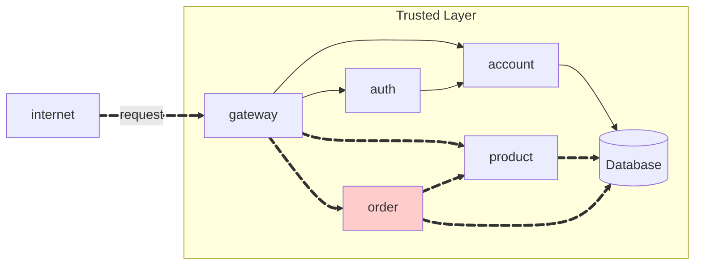
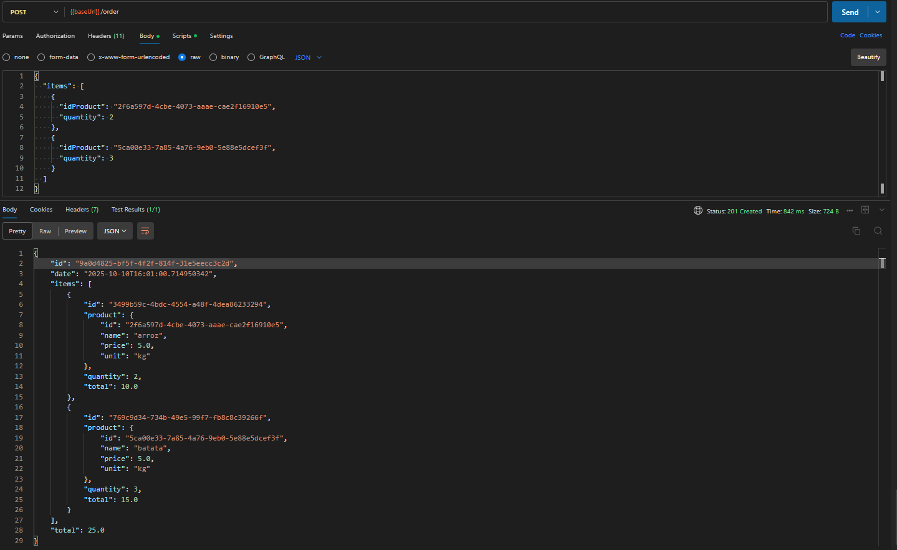
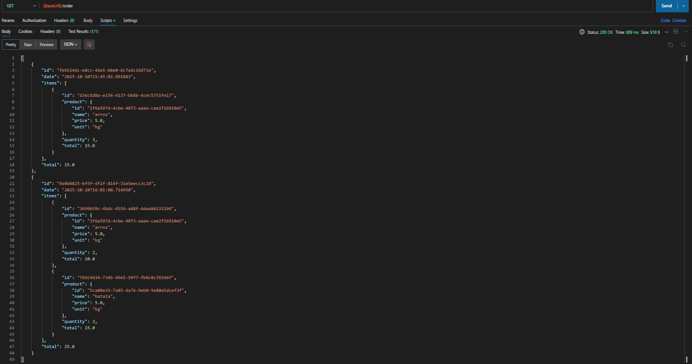
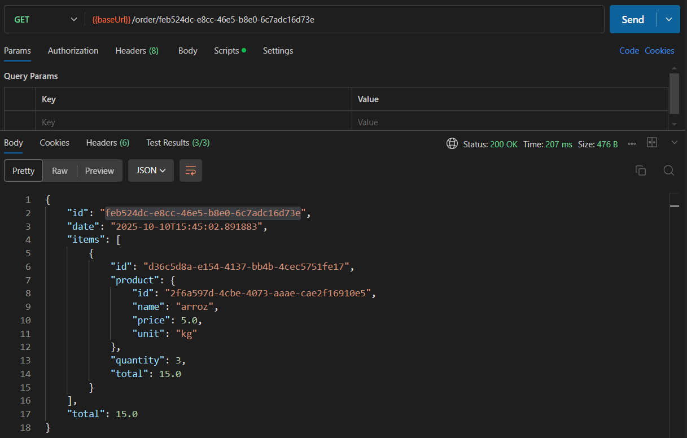

# Exercício 2 - Order API



## Repositórios

### 1. Order Repository
**Link:** [https://github.com/RicardolCarvalho/order](https://github.com/RicardolCarvalho/order)

**Estrutura do projeto:**
```bash
order/
├── src/main/java/store/order/
│   ├── OrderController.java
│   ├── OrderIn.java
│   ├── OrderItemIn.java
│   ├── OrderItemOut.java
│   └── OrderOut.java
├── pom.xml
└── .gitignore
```

### 2. Order Service Repository
**Link:** [https://github.com/RicardolCarvalho/order-service](https://github.com/RicardolCarvalho/order-service)

**Estrutura do projeto:**
```bash
order-service/
├── src/main/
│   ├── FeignAuth.java
│   ├── Order.java
│   ├── OrderApplication.java
│   ├── OrderItem.java
│   ├── OrderItemModel.java
│   ├── OrderModel.java
│   ├── OrderParser.java
│   ├── OrderRepository.java
│   ├── OrderRequest.java
│   ├── OrderResource.java
│   └── OrderService.java
├── DockerFile
├── pom.xml
└── .gitignore
```

## Código Fonte das Atividades

### Principais Componentes Implementados

#### 1. OrderController.java
Controlador REST responsável por expor os endpoints da API de pedidos:

```java
@RestController
@RequestMapping("/order")
public class OrderController {
    
    @Autowired
    private OrderService orderService;
    
    @PostMapping
    public ResponseEntity<OrderOut> createOrder(@RequestBody OrderIn orderIn) {
        OrderOut order = orderService.createOrder(orderIn);
        return ResponseEntity.status(201).body(order);
    }
    
    @GetMapping
    public ResponseEntity<List<OrderOut>> getAllOrders() {
        List<OrderOut> orders = orderService.getOrdersByCurrentUser();
        return ResponseEntity.ok(orders);
    }
    
    @GetMapping("/{id}")
    public ResponseEntity<OrderOut> getOrderById(@PathVariable String id) {
        OrderOut order = orderService.getOrderById(id);
        return ResponseEntity.ok(order);
    }
}
```

#### 2. Order.java (Entidade)
Entidade JPA representando um pedido no banco de dados:

```java
@Entity
@Table(name = "orders")
public class Order {
    
    @Id
    @GeneratedValue(strategy = GenerationType.UUID)
    private String id;
    
    @Column(nullable = false)
    private String userId;
    
    @Column(nullable = false)
    private LocalDateTime date;
    
    @OneToMany(mappedBy = "order", cascade = CascadeType.ALL, fetch = FetchType.LAZY)
    private List<OrderItem> items;
    
    @Column(nullable = false)
    private Double total;
}
```

#### 3. OrderService.java
Camada de serviço contendo a lógica de negócio para pedidos:

```java
@Service
public class OrderService {
    
    @Autowired
    private OrderRepository orderRepository;
    
    @Autowired
    private CurrentUser currentUser;
    
    @Autowired
    private FeignAuth feignAuth;
    
    public OrderOut createOrder(OrderIn orderIn) {
        validateProducts(orderIn.getItems());
        
        Order order = new Order();
        order.setUserId(currentUser.getId());
        order.setDate(LocalDateTime.now());
        
        List<OrderItem> items = processOrderItems(orderIn.getItems(), order);
        order.setItems(items);
        
        double total = items.stream()
                .mapToDouble(OrderItem::getTotal)
                .sum();
        order.setTotal(total);
        
        Order savedOrder = orderRepository.save(order);
        return OrderParser.toOut(savedOrder);
    }
    
    public List<OrderOut> getOrdersByCurrentUser() {
        List<Order> orders = orderRepository.findByUserId(currentUser.getId());
        return orders.stream()
                .map(OrderParser::toOut)
                .collect(Collectors.toList());
    }
}
```

#### 4. FeignAuth.java (Cliente de Integração)

```java
@FeignClient(name = "auth-service", url = "${auth.service.url}")
public interface FeignAuth {
    
    @GetMapping("/product/{id}")
    ProductOut getProduct(@PathVariable String id, 
                         @RequestHeader("Authorization") String token);
    
    @PostMapping("/auth/validate")
    UserOut validateToken(@RequestHeader("Authorization") String token);
}
```

## Order API

!!! info "POST /order"

    Create a new order **for the current user**.

    === "Request"

        ``` { .json .copy .select linenums='1' }
        {
            "items": [
                {
                    "idProduct": "0195abfb-7074-73a9-9d26-b4b9fbaab0a8",
                    "quantity": 2
                },
                {
                    "idProduct": "0195abfe-e416-7052-be3b-27cdaf12a984",
                    "quantity": 1
                }
            ]
        }
        ```

    === "Response"

        ``` { .json .copy .select linenums='1' }
        {
            "id": "0195ac33-73e5-7cb3-90ca-7b5e7e549569",
            "date": "2025-09-01T12:30:00",
            "items": [
                {
                    "id": "01961b9a-bca2-78c4-9be1-7092b261f217",
                    "product": {
                        "id": "0195abfb-7074-73a9-9d26-b4b9fbaab0a8"
                    },
                    "quantity": 2,
                    "total": 20.24
                },
                {
                    "id": "01961b9b-08fd-76a5-8508-cdb6cd5c27ab",
                    "product": {
                        "id": "0195abfe-e416-7052-be3b-27cdaf12a984"
                    },
                    "quantity": 10,
                    "total": 6.2
                }
            ],
            "total": 26.44
        }
        ```
        ```bash
        Response code: 201 (created)
        Response code: 400 (bad request), if the product does not exist.
        ```

    === "Postman"
        { width=100% }

!!! info "GET /order"

    Get all orders **for the current user**.

    === "Response"

        ``` { .json .copy .select linenums='1' }
        [
            {
                "id": "0195ac33-73e5-7cb3-90ca-7b5e7e549569",
                "date": "2025-09-01T12:30:00",
                "total": 26.44
            },
            {
                "id": "0195ac33-cbbd-7a6e-a15b-b85402cf143f",
                "date": "2025-10-09T03:21:57",
                "total": 18.6
            }
            
        ]
        ```
        ```bash
        Response code: 200 (ok)
        ```
    === "Postman"
        { width=100% }

!!! info "GET /order/{id}"

    Get the order details by its ID. **The order must belong to the current user.**, otherwise, return a `404`.

    === "Response"

        ``` { .json .copy .select linenums='1' }
        {
            "id": "0195ac33-73e5-7cb3-90ca-7b5e7e549569",
            "date": "2025-09-01T12:30:00",
            "items": [
                {
                    "id": "01961b9a-bca2-78c4-9be1-7092b261f217",
                    "product": {
                        "id": "0195abfb-7074-73a9-9d26-b4b9fbaab0a8",
                    },
                    "quantity": 2,
                    "total": 20.24
                },
                {
                    "id": "01961b9b-08fd-76a5-8508-cdb6cd5c27ab",
                    "product": {
                        "id": "0195abfe-e416-7052-be3b-27cdaf12a984",
                    },
                    "quantity": 10,
                    "total": 6.2
                }
            ],
            "total": 26.44
        }
        ```
        ```bash
        Response code: 200 (ok)
        Response code: 404 (not found), if the order does not belong to the current user.
        ```

    === "Postman"
        { width=100% }

## Vídeo de Apresentação

**Link do Vídeo:** [https://www.youtube.com/watch?v=dQw4w9WgXcQ](https://www.youtube.com/watch?v=dQw4w9WgXcQ)
---

> This MkDocs was created by [Ricardo Luz Carvalho](https://github.com/RicardolCarvalho)
