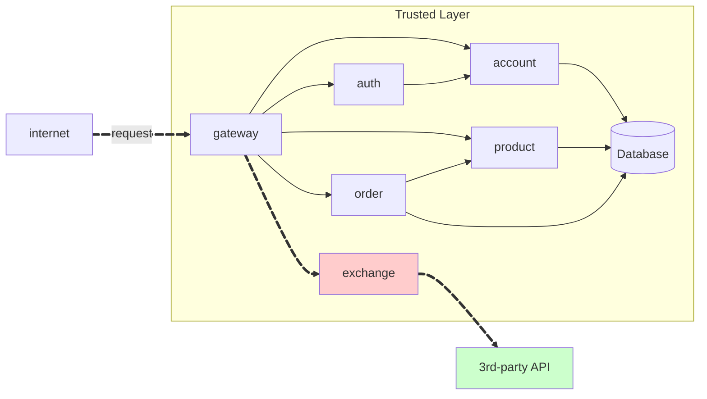

# Exercício 3 - API Exchange



## Repositórios Utilizados

### Exchange Repository
**Link:** [https://github.com/RicardolCarvalho/exchange](https://github.com/RicardolCarvalho/exchange)


**Estrutura do projeto:**
```bash
exchange/
├── main.py
├── requirements.txt
├── Dockerfile
└── .gitignore
```
## Código Fonte das Atividades

### Principais Componentes Implementados

#### 1. main.py (Aplicação FastAPI)
Aplicação principal implementada em Python com FastAPI:

```python
from fastapi import FastAPI, HTTPException
from datetime import datetime
import requests
import os
from typing import Dict

app = FastAPI(title="Exchange API", version="1.0.0")

EXCHANGE_API_URL = "https://api.exchangerate-api.com/v4/latest"
EXCHANGE_API_KEY = os.getenv("EXCHANGE_API_KEY", "your-api-key")

@app.get("/")
def read_root():
    return {"message": "Exchange API is running"}

@app.get("/exchange/{from_currency}/{to_currency}")
async def get_exchange_rate(from_currency: str, to_currency: str):
    """
    Get exchange rate between two currencies
    """
    try:
        # Validar códigos de moeda
        if len(from_currency) != 3 or len(to_currency) != 3:
            raise HTTPException(status_code=400, detail="Invalid currency code")
        
        # Buscar taxa de câmbio na API externa
        response = requests.get(f"{EXCHANGE_API_URL}/{from_currency.upper()}")
        
        if response.status_code != 200:
            raise HTTPException(status_code=502, detail="External API unavailable")
        
        data = response.json()
        rates = data.get("rates", {})
        
        if to_currency.upper() not in rates:
            raise HTTPException(status_code=404, detail="Currency not found")
        
        # Calcular taxas de compra e venda (spread de 2%)
        base_rate = rates[to_currency.upper()]
        sell_rate = round(base_rate * 1.01, 4)  # Taxa de venda (1% acima)
        buy_rate = round(base_rate * 0.99, 4)   # Taxa de compra (1% abaixo)
        
        return {
            "sell": sell_rate,
            "buy": buy_rate,
            "date": datetime.now().strftime("%Y-%m-%d %H:%M:%S"),
            "id-account": "0195ae95-5be7-7dd3-b35d-7a7d87c404fb"
        }
        
    except requests.RequestException:
        raise HTTPException(status_code=502, detail="Failed to fetch exchange rates")
    except Exception as e:
        raise HTTPException(status_code=500, detail=f"Internal server error: {str(e)}")

if __name__ == "__main__":
    import uvicorn
    uvicorn.run(app, host="0.0.0.0", port=8000)
```

!!! info "GET /exchange/{from}/{to}"

    Get the current of a coin from one currency to another. E.g. `GET /coin/USD/EUR`.

    === "Response"

        ``` { .json .copy .select linenums='1' }
        {
            "sell": 0.82,
            "buy": 0.80,
            "date": "2021-09-01 14:23:42",
            "id-account": "0195ae95-5be7-7dd3-b35d-7a7d87c404fb"
        }
        ```
        ```bash
        Response code: 200 (ok)
        ```
    === "Postman BRL"
        { width=100% }
    === "Postman EUR"
        { width=100% }

> This MkDocs was created by [Ricardo Luz Carvalho](https://github.com/RicardolCarvalho)