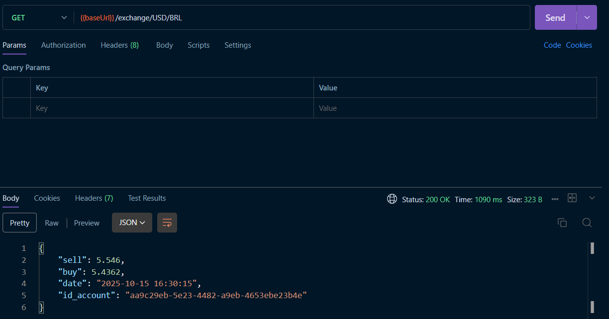
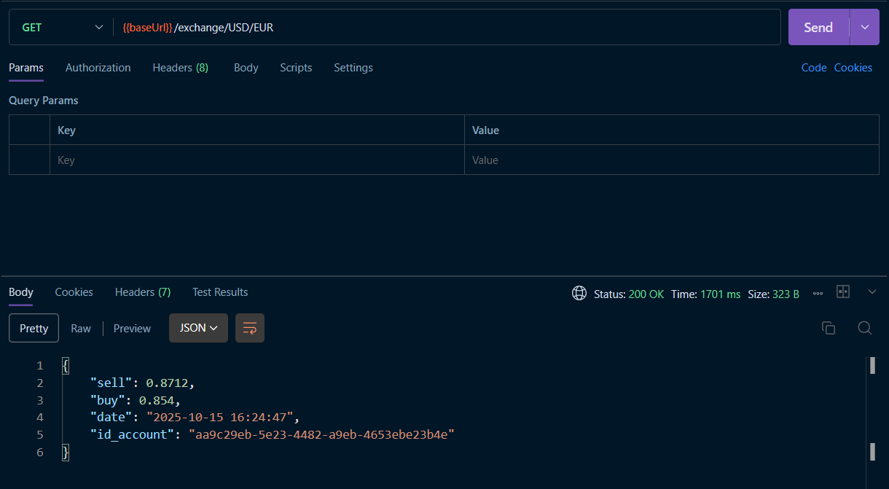

Now, the user wants to create an API that allows the user to convert between currencies. The API should use a third-party API to get the exchange rates. Note, this microservice ==HAVE TO== be code in Python.


# Repositórios
- [Exchange](https://github.com/RicardolCarvalho/exchange)
```bash
exchange/
├── main.py
├── requirements.txt
├── Dockerfile
├── .gitignore
```

!!! info "GET /exchange/{from}/{to}"

    Get the current of a coin from one currency to another. E.g. `GET /coin/USD/EUR`.

    === "Response"

        ``` { .json .copy .select linenums='1' }
        {
            "sell": 0.82,
            "buy": 0.80,
            "date": "2021-09-01 14:23:42",
            "id-account": "0195ae95-5be7-7dd3-b35d-7a7d87c404fb"
        }
        ```
        ```bash
        Response code: 200 (ok)
        ```
    === "Postman BRL"
        { width=100% }
    === "Postman EUR"
        { width=100% }

> This MkDocs was created by [Ricardo Luz Carvalho](https://github.com/RicardolCarvalho)