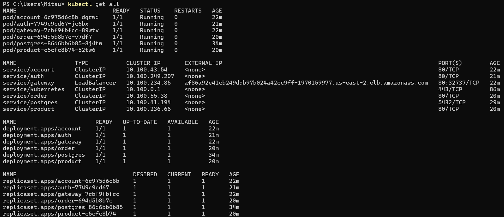

# Exercício 5 - MiniKube

## Repositórios Utilizados

1. **[Account Service](https://github.com/RicardolCarvalho/account.service)** - Serviço de contas de usuário
2. **[Auth Service](https://github.com/RicardolCarvalho/auth-service)** - Serviço de autenticação
3. **[Gateway Service](https://github.com/RicardolCarvalho/gateway-service)** - API Gateway
4. **[Product Service](https://github.com/RicardolCarvalho/product-service)** - Serviço de produtos
5. **[Order Service](https://github.com/RicardolCarvalho/order-service)** - Serviço de pedidos
6. **[Postgres Service](https://github.com/RicardolCarvalho/pma.25.2)** - Banco de Dados (gitignore)

**Estrutura do projeto:**
```bash
api/
├── account-service/
│   ├── Jenkinsfile
│   ├── Dockerfile
│   ├── k8s/
│   │   └── k8s.yaml
│   └── src/...
├── auth-service/
│   ├── Jenkinsfile
│   ├── Dockerfile
│   ├── k8s/
│   │   └── k8s.yaml
│   └── src/...
├── gateway-service/
│   ├── Jenkinsfile
│   ├── Dockerfile
│   ├── k8s/
│   │   └── k8s.yaml
│   └── src/...
├── product-service/
│   ├── Jenkinsfile
│   ├── Dockerfile
│   ├── k8s/
│   │   └── k8s.yaml
│   └── src/...
└── order-service/
    ├── Jenkinsfile
    ├── Dockerfile
    ├── k8s/
    │   └── k8s.yaml
    └── src/...
```

## Códigos

### Kubernetes Configurations

=== "Account Service"
    ```yaml
    # k8s/k8s.yaml
    apiVersion: apps/v1
    kind: Deployment
    metadata:
      name: account
    spec:
      replicas: 1
      selector:
        matchLabels:
          app: account
      template:
        metadata:
          labels:
            app: account
        spec:
          containers:
            - name: account
              image: ricardolcarvalho/account:latest
              imagePullPolicy: Always
              ports:
                - containerPort: 8080
              env:
                - name: POSTGRES_DB
                  valueFrom:
                    configMapKeyRef:
                      name: postgres-configmap
                      key: POSTGRES_DB
                - name: DATABASE_USERNAME
                  valueFrom:
                    secretKeyRef:
                      name: postgres-secrets
                      key: POSTGRES_USER
                - name: DATABASE_PASSWORD
                  valueFrom:
                    secretKeyRef:
                      name: postgres-secrets
                      key: POSTGRES_PASSWORD
                - name: DATABASE_URL
                  value: "jdbc:postgresql://postgres:5432/$(POSTGRES_DB)"
              resources:
                requests:
                  memory: "200Mi"
                  cpu: "50m"
                limits:
                  memory: "300Mi"
                  cpu: "200m"
    ---
    apiVersion: v1
    kind: Service
    metadata:
      name: account
      labels:
        app: account
    spec:
      type: ClusterIP
      ports:
        - port: 80
          protocol: TCP
          targetPort: 8080
      selector:
        app: account
    ```

=== "Auth Service"
    ```yaml
    # k8s/k8s.yaml
    apiVersion: apps/v1
    kind: Deployment
    metadata:
      name: auth
    spec:
      replicas: 1
      selector:
        matchLabels:
          app: auth
      template:
        metadata:
          labels:
            app: auth
        spec:
          containers:
            - name: auth
              image: ricardolcarvalho/auth:latest
              imagePullPolicy: Always
              ports:
                - containerPort: 8080
              env:
                - name: POSTGRES_DB
                  valueFrom:
                    configMapKeyRef:
                      name: postgres-configmap
                      key: POSTGRES_DB
                - name: DATABASE_USERNAME
                  valueFrom:
                    secretKeyRef:
                      name: postgres-secrets
                      key: POSTGRES_USER
                - name: DATABASE_PASSWORD
                  valueFrom:
                    secretKeyRef:
                      name: postgres-secrets
                      key: POSTGRES_PASSWORD
                - name: DATABASE_URL
                  value: "jdbc:postgresql://postgres:5432/$(POSTGRES_DB)"
              resources:
                requests:
                  memory: "200Mi"
                  cpu: "50m"
                limits:
                  memory: "300Mi"
                  cpu: "200m"
    ---
    apiVersion: v1
    kind: Service
    metadata:
      name: auth
      labels:
        app: auth
    spec:
      type: ClusterIP
      ports:
        - port: 80
          protocol: TCP
          targetPort: 8080
      selector:
        app: auth
    ```

=== "Gateway Service"
    ```yaml
    # k8s/k8s.yaml
    apiVersion: apps/v1
    kind: Deployment
    metadata:
      name: gateway
    spec:
      replicas: 1
      selector:
        matchLabels:
          app: gateway
      template:
        metadata:
          labels:
            app: gateway
        spec:
          containers:
            - name: gateway
              image: ricardolcarvalho/gateway:latest
              imagePullPolicy: Always
              ports:
                - containerPort: 8080
              resources:
                requests:
                  memory: "200Mi"
                  cpu: "50m"
                limits:
                  memory: "300Mi"
                  cpu: "200m"
    ---
    apiVersion: v1
    kind: Service
    metadata:
      name: gateway
      labels:
        app: gateway
    spec:
      type: LoadBalancer
      ports:
        - port: 80
          protocol: TCP
          targetPort: 8080
      selector:
        app: gateway
    ```

=== "Product Service"
    ```yaml
    # k8s/k8s.yaml
    apiVersion: apps/v1
    kind: Deployment
    metadata:
      name: product
    spec:
      replicas: 1
      selector:
        matchLabels:
          app: product
      template:
        metadata:
          labels:
            app: product
        spec:
          containers:
            - name: product
              image: ricardolcarvalho/product:latest
              imagePullPolicy: Always
              ports:
                - containerPort: 8080
              env:
                - name: POSTGRES_DB
                  valueFrom:
                    configMapKeyRef:
                      name: postgres-configmap
                      key: POSTGRES_DB
                - name: DATABASE_USERNAME
                  valueFrom:
                    secretKeyRef:
                      name: postgres-secrets
                      key: POSTGRES_USER
                - name: DATABASE_PASSWORD
                  valueFrom:
                    secretKeyRef:
                      name: postgres-secrets
                      key: POSTGRES_PASSWORD
                - name: DATABASE_URL
                  value: "jdbc:postgresql://postgres:5432/$(POSTGRES_DB)"
                - name: SPRING_CACHE_TYPE
                  value: redis
                - name: SPRING_DATA_REDIS_HOST
                  value: redis
                - name: SPRING_DATA_REDIS_PORT
                  value: "6379"
              resources:
                requests:
                  memory: "200Mi"
                  cpu: "50m"
                limits:
                  memory: "300Mi"
                  cpu: "200m"
    ---
    apiVersion: v1
    kind: Service
    metadata:
      name: product
      labels:
        app: product
    spec:
      type: ClusterIP
      ports:
        - port: 80
          protocol: TCP
          targetPort: 8080
      selector:
        app: product
    ```

=== "Order Service"
    ```yaml
    # k8s/k8s.yaml
    apiVersion: apps/v1
    kind: Deployment
    metadata:
      name: order
    spec:
      replicas: 1
      selector:
        matchLabels:
          app: order
      template:
        metadata:
          labels:
            app: order
        spec:
          containers:
            - name: order
              image: ricardolcarvalho/order:latest
              imagePullPolicy: Always
              ports:
                - containerPort: 8080
              env:
                - name: POSTGRES_DB
                  valueFrom:
                    configMapKeyRef:
                      name: postgres-configmap
                      key: POSTGRES_DB
                - name: DATABASE_USERNAME
                  valueFrom:
                    secretKeyRef:
                      name: postgres-secrets
                      key: POSTGRES_USER
                - name: DATABASE_PASSWORD
                  valueFrom:
                    secretKeyRef:
                      name: postgres-secrets
                      key: POSTGRES_PASSWORD
                - name: DATABASE_URL
                  value: "jdbc:postgresql://postgres:5432/$(POSTGRES_DB)"
              resources:
                requests:
                  memory: "200Mi"
                  cpu: "50m"
                limits:
                  memory: "300Mi"
                  cpu: "200m"
    ---
    apiVersion: v1
    kind: Service
    metadata:
      name: order
      labels:
        app: order
    spec:
      type: ClusterIP
      ports:
        - port: 80
          protocol: TCP
          targetPort: 8080
      selector:
        app: order
    ```


> This MkDocs was created by [Ricardo Luz Carvalho](https://github.com/RicardolCarvalho)
