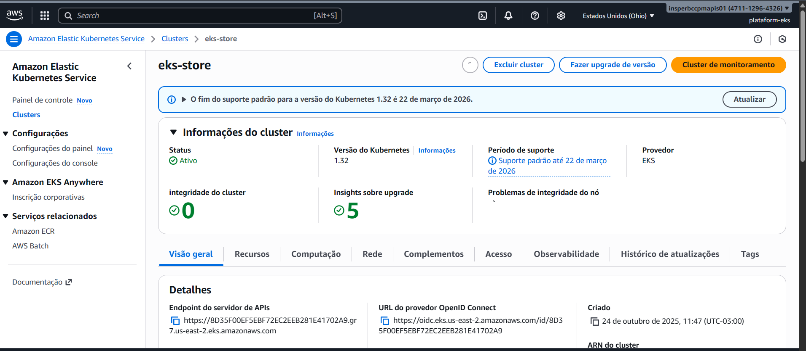
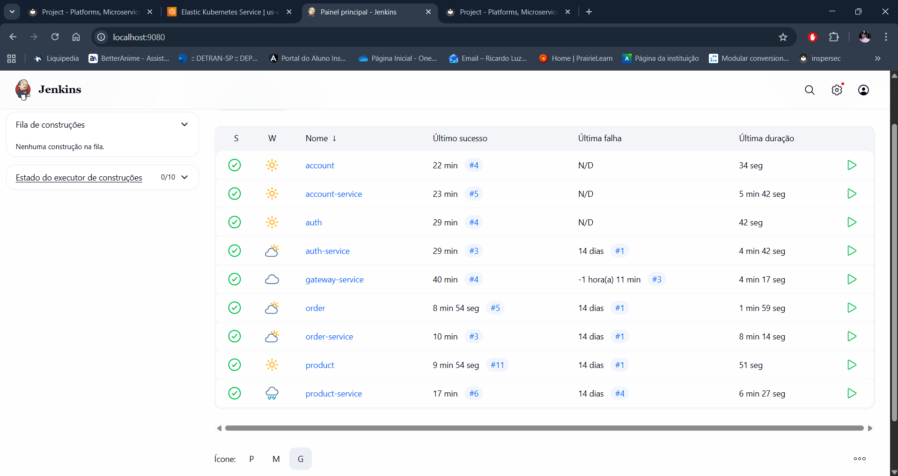
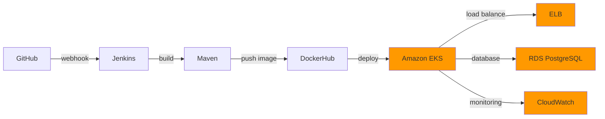

# Projeto - Deploy Spring Boot no EKS

## 1. Configuração AWS

### AWS CLI

Instalação e configuração:

```bash
aws configure
```

[Documentação AWS CLI](https://docs.aws.amazon.com/cli/latest/userguide/getting-started-install.html)

## 2. EKS - Cluster Kubernetes

Cluster criado com as seguintes configurações:
- **Nome**: eks-store
- **Região**: us-east-2
- **Node Type**: t2.small



Conectar kubectl ao cluster:

```bash
aws eks update-kubeconfig --name eks-store
```

## 3. Testes de Carga com HPA

### Configuração do HPA

Criar autoscaler para o gateway:

```bash
kubectl autoscale deployment gateway --cpu-percent=50 --min=1 --max=10
```

Verificar status:

```bash
kubectl get hpa  
```

### Executar Teste de Carga

```bash
kubectl run -i --tty load-generator --rm --image=busybox:1.28 --restart=Never -- /bin/sh -c "while sleep 0.01; do wget -q -O- http://gateway/info; done"
```

### Resultado

<video controls="" width="640" height="360" src="docs/projeto/video/TesteDeCarga.mp4"> Your browser does not support the video tag. </video>

## 4. CI/CD com Jenkins

### Configuração do Jenkins

The Jenkins environment is configured using Docker Compose:

```yaml
# docker compose up -d --build --force-recreate
name: ops

services:

  jenkins:
    container_name: jenkins
    build:
      dockerfile_inline: |
        FROM jenkins/jenkins:jdk21
        USER root

        # Install tools
        RUN apt-get update && apt-get install -y lsb-release iputils-ping maven

        # Install Docker
        RUN curl -fsSLo /usr/share/keyrings/docker-archive-keyring.asc \
          https://download.docker.com/linux/debian/gpg
        RUN echo "deb [arch=$(dpkg --print-architecture) \
          signed-by=/usr/share/keyrings/docker-archive-keyring.asc] \
          https://download.docker.com/linux/debian \
          $(lsb_release -cs) stable" > /etc/apt/sources.list.d/docker.list
        RUN apt-get update && apt-get install -y docker-ce

        # Install kubectl
        RUN apt-get install -y apt-transport-https ca-certificates curl
        RUN curl -fsSL https://pkgs.k8s.io/core:/stable:/v1.30/deb/Release.key | gpg --dearmor -o /etc/apt/keyrings/kubernetes-apt-keyring.gpg
        RUN chmod 644 /etc/apt/keyrings/kubernetes-apt-keyring.gpg
        RUN echo 'deb [signed-by=/etc/apt/keyrings/kubernetes-apt-keyring.gpg] https://pkgs.k8s.io/core:/stable:/v1.30/deb/ /' | tee /etc/apt/sources.list.d/kubernetes.list
        RUN chmod 644 /etc/apt/sources.list.d/kubernetes.list
        RUN apt-get update && apt-get install -y kubectl

        # Install AWS CLI
        RUN apt-get install -y unzip
        RUN curl "https://awscli.amazonaws.com/awscli-exe-linux-x86_64.zip" -o "awscliv2.zip" && \
            unzip awscliv2.zip && \
            ./aws/install && \
            rm -rf aws awscliv2.zip

        RUN usermod -aG docker jenkins
    ports:
      - 9080:8080
    volumes:
      - ${CONFIG:-./config}/jenkins:/var/jenkins_home
      - /var/run/docker.sock:/var/run/docker.sock
    restart: always
```

### Pipeline Jenkinsfile

Pipeline completo com Build, Push e Deploy:

```groovy
pipeline {
    agent any
    environment {
        SERVICE = 'gateway'
        NAME = "ricardolcarvalho/${env.SERVICE}"
    }
    stages {
        stage('Build') { 
            steps {
                sh 'mvn -B -DskipTests clean package'
            }
        }      
        stage('Build & Push Image') {
            steps {
                withCredentials([usernamePassword(
                    credentialsId: 'dockerhub-credential',
                    usernameVariable: 'USERNAME',
                    passwordVariable: 'TOKEN')])
                {
                    sh "docker login -u $USERNAME -p $TOKEN"
                    sh "docker buildx create --use --platform=linux/arm64,linux/amd64 --node multi-platform-builder-${env.SERVICE} --name multi-platform-builder-${env.SERVICE}"
                    sh "docker buildx build --platform=linux/arm64,linux/amd64 --push --tag ${env.NAME}:latest --tag ${env.NAME}:${env.BUILD_ID} -f Dockerfile ."
                    sh "docker buildx rm --force multi-platform-builder-${env.SERVICE}"
                }
            }
        }
        stage('Deploy to EKS') {
            steps {
                withCredentials([
                    string(credentialsId: 'aws-access-key-id', variable: 'AWS_ACCESS_KEY_ID'),
                    string(credentialsId: 'aws-secret-access-key', variable: 'AWS_SECRET_ACCESS_KEY'),
                    string(credentialsId: 'aws-region', variable: 'AWS_REGION'),
                    string(credentialsId: 'eks-cluster-name', variable: 'CLUSTER_NAME')
                ]) {
                    sh "aws eks update-kubeconfig --region ${AWS_REGION} --name ${CLUSTER_NAME}"
                    sh "kubectl set image deployment/${env.SERVICE} ${env.SERVICE}=${env.NAME}:${env.BUILD_ID} -n default"
                    sh "kubectl rollout status deployment/${env.SERVICE} -n default"
                }
            }
        }
    }
}
```


## 5. Análise de Custos

### AWS Cost Explorer

O AWS Cost Explorer é uma ferramenta para visualizar, entender e gerenciar os custos e o uso da AWS ao longo do tempo.

**Acessando o Cost Explorer:**
1. Console AWS → **Billing and Cost Management**
2. Menu lateral → **Cost Explorer**

### Custos Reais do Projeto

**Período analisado:** Outubro 2025  
**Custo atual:** US$ 51,37  
**Previsão para o final do mês:** US$ 56,88


### Breakdown por Serviço

| Serviço | Custo (US$) | Percentual |
|---------|-------------|------------|
| Elastic Container Service for Kubernetes (EKS) | $15,81 | 30,8% |
| EC2 - Other | $15,06 | 29,3% |
| EC2 - Compute | $7,18 | 14,0% |
| Tax | $6,23 | 12,1% |
| Elastic Load Balancing | $3,95 | 7,7% |
| Outros | $3,15 | 6,1% |
| **Total (até 25 de outubro)** | **$51,37** | **100%** |

### Análise dos Custos

**Principais serviços:**

1. **Amazon EKS** (US$ 15,81)
   - Control Plane do cluster Kubernetes
   - Custo fixo de ~$0.10/hora
   - Essencial para orquestração de containers

2. **EC2 - Other** (US$ 15,06)
   - EBS Volumes e Snapshots
   - Armazenamento dos nodes

3. **EC2 - Compute** (US$ 7,18)
   - Instâncias t2.small
   - Nodes do cluster (2 instâncias)

4. **Elastic Load Balancing** (US$ 3,95)
   - Load Balancer para distribuição de tráfego
   - Entrada da aplicação

5. **Tax** (US$ 6,23)
   - Impostos sobre os serviços AWS

### Projeção Mensal

Baseado na previsão da AWS:
- **Custo projetado:** US$ 56,88/mês
- **Dias em operação:** ~25 dias (até o momento)
- **Média diária:** US$ 2,27/dia

[AWS Cost Explorer Console](https://console.aws.amazon.com/cost-management/home)  
[Calculadora de Preços AWS](https://calculator.aws/#/)

## Custo atual do projeto

**Dashboard de Custo e Uso - Atualização:**

- **Mês atual:** US$ 97,71 (aumento de 1.294%)
- **Previsão para o final do mês:** US$ 214,19 (aumento de 271%)

O gráfico abaixo mostra a evolução dos custos por mês, com breakdown por serviço:


## 6. Plataforma como Serviço (PaaS)

### Serviços PaaS Utilizados

**1. Amazon EKS**
- Kubernetes gerenciado
- Control plane mantido pela AWS
- Escalabilidade automática

**2. Elastic Load Balancing**
- Distribuição automática de tráfego
- Health checks dos pods

**3. Amazon RDS**
- PostgreSQL gerenciado
- Backups e patches automáticos

**4. CloudWatch**
- Logs e métricas centralizados
- Monitoramento integrado

### Arquitetura



> This MkDocs was created by [Ricardo Luz Carvalho](https://github.com/RicardolCarvalho)